Equipment List
==============

.. Name
   -----------

  .. image:: ../img/equipment/foo.jpg
    :width: 30%
  
  :Model number(s): 
    numbers here
  :Homologation number(s):
    numbers here
  :Description: 
    Desc here
  :Troubleshooting: 
    TS here

Start Area
~~~~~~~~~~

Start Block
-----------

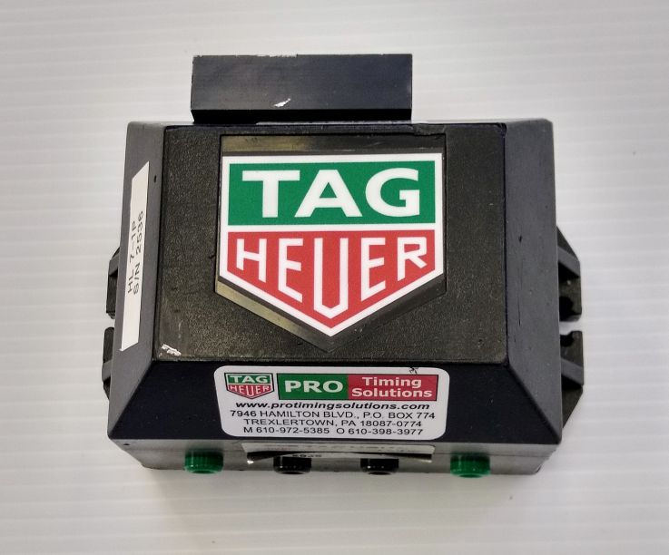
  
:Model number(s): 
  Tag-Heuer HL 7-1, HL 7-1P
:Homologation number(s):
  TAG.S54.03 (HL 7-1), TAG.S77T.09 (HL 7-1P)
:Relevant rule(s):
  :term:`611.2.1.1`
:Description: 
  Start block for homologated races. Two separate internal contacts connected to two banana plug outputs on the bottom.
:Troubleshooting: 
  Check all connections. Check for signs of lightning damage. A malfunctioning start block will typically need to be sent in for service.
  
Start Wand
-----------

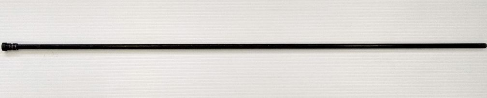
  
:Model number(s): 
  N/A
:Homologation number(s):
  N/A
:Relevant rule(s):
  N/A
:Description: 
  Start wand to fit into TAG Start Block
:Troubleshooting: 
  If it breaks throw it away
  
Start Block Chain
------------------

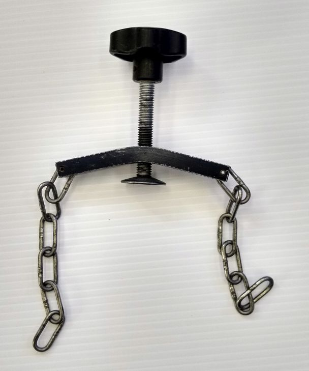
  
:Model number(s): 
  N/A
:Homologation number(s):
  N/A
:Relevant rule(s):
  N/A
:Description: 
  Backing chain to attach start block to start post.
:Troubleshooting: 
 

.. _headset:

Headset with TAG Plug Adaptor Attached
--------------------------------------

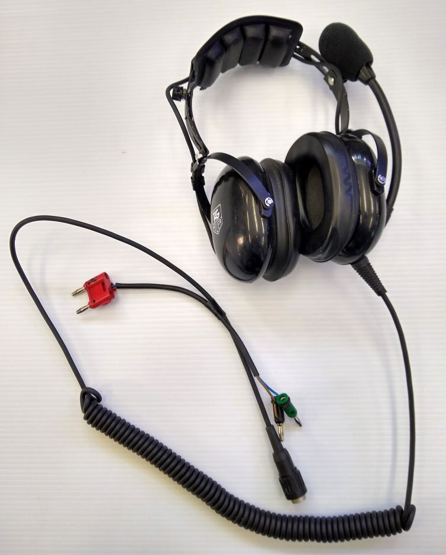
  
:Model number(s): 
  
:Homologation number(s):
  N/A
:Relevant rule(s):
  :term:`611.1`
:Description: 
  Headset to fit into TAG HL 551 Com Box
:Troubleshooting: 
  Check wires for signs of damage. Check connections for moisture. Check batteries in com box.
  
Com Box
-----------

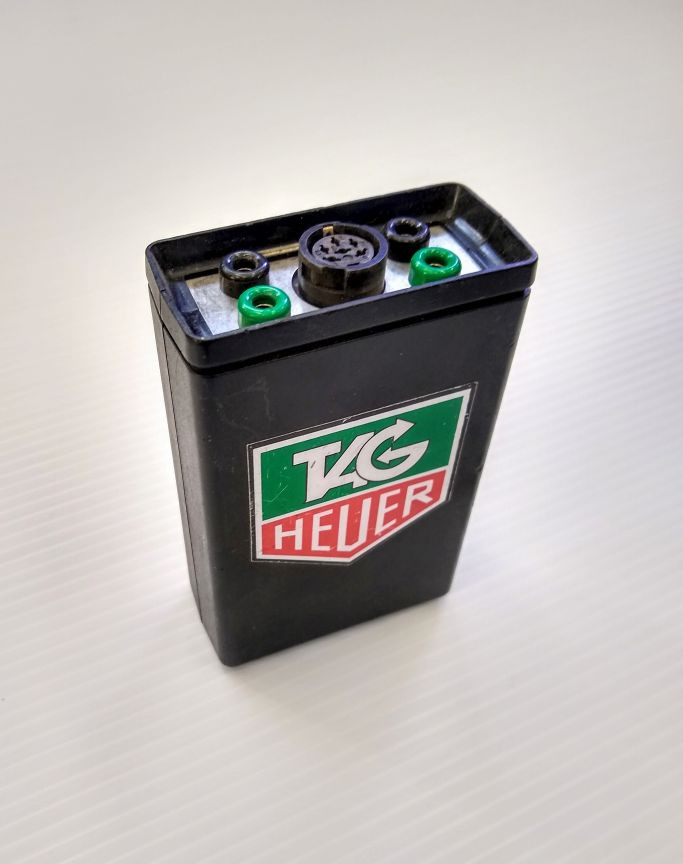
  
:Model number(s): 
  HL 551
:Homologation number(s):
  N/A
:Relevant rule(s):
  :term:`611.1`
:Description: 
  Com Box to connect to TAG headsets.
:Troubleshooting: 
  Check connections. Check 9v battery. 
  
Start Gater
-----------

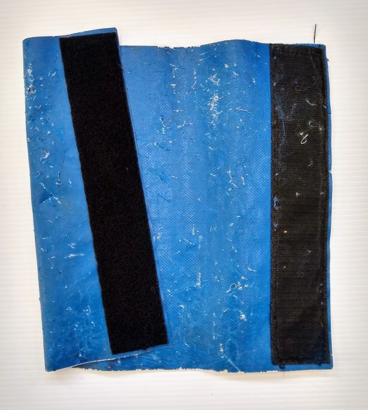
  
:Model number(s): 
  N/A
:Homologation number(s):
  N/A
:Relevant rule(s):
  N/A
:Description: 
  Blue plastic with velcro. Used to wrap around start post to protect wiring and connections from ski poles etc.
:Troubleshooting: 
  If velcro won't attach securely, use tape.
  
Electronic Start Clock
----------------------

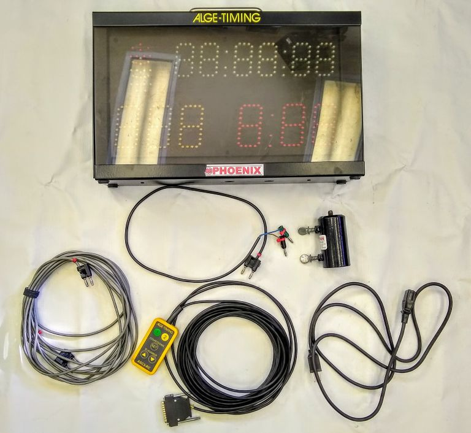
  
:Model number(s): 
  Alge ASC3
:Homologation number(s):
  N/A
:Relevant rule(s):
  :term:`611.2.1.3`
:Description: 
  Electronic start clock displaying time of day, along with a visual and acoustic start cadence.
:Troubleshooting: 
  See document: :doc:`in-depth/alge-asc3`
  
Free Course Start Controller
----------------------------

.. image:: ../img/ralphies-free-course/selftimer-start-controller.jpg
	:width: 25%
	:align: left
	
:Model number(s): 
  Alge SF#
:Homologation number(s):
  N/A
:Relevant rule(s):
  N/A
:Description: 
  Used in conjunction with the :ref:`Alge Self Timer` to operate the public free course.
:Troubleshooting: 
  See document: :doc:`in-depth/alge-self-timer`

Finish Area
~~~~~~~~~~~
  
Impulse Distributor
-------------------

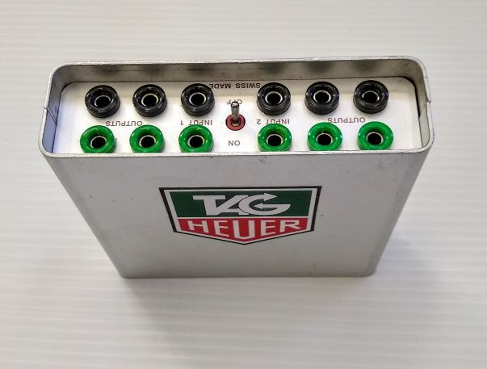
  
:Model number(s): 
  HL 553
:Homologation number(s):
  N/A
:Relevant rule(s):
  N/A
:Description: 
  An impulse distributor with two inputs, each input with two outputs. Used to eliminate false impulses caused by electrical noise at Mammoth Mountain.
:Troubleshooting: 
  Turn it on! Check batteries. Check all connections. Is an input light solid red? This indicates a wiring problem, possibly a short in the hill wire. Sometimes reversing polarity can help
  
Photocell Pair
--------------

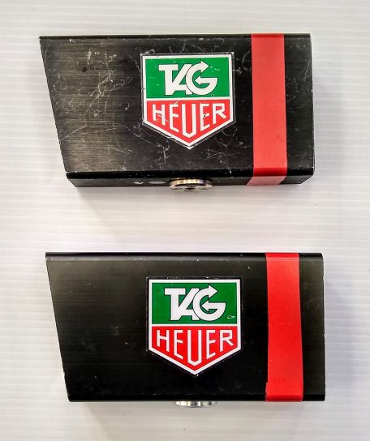
  
:Model number(s): 
  HL 2-31, HL2-32, HL 2-33
:Homologation number(s):
  TAG.L47.03 (HL 2-31), TAG.L49T.10 (HL 2-32), TAG.L50.03 (HL 2-33), TAG.L48.03 (HL 2-35 R-E), TAG.L100.16 (HL 3-135)
:Relevant rule(s):
  :term:`611.2.1.2`
:Description: 
  Matched pair of photocells for finish line or intermediate time.
:Troubleshooting: 
  Check batteries. Check to see if photocell lense is clouded over. Make sure pair is matched. HL 2-32 and 2-33 pairs require on receiver photocell and one transmitter photocell. HL 2-31 matched pairs should be close in serial number.
  
Photocell Gimble
----------------

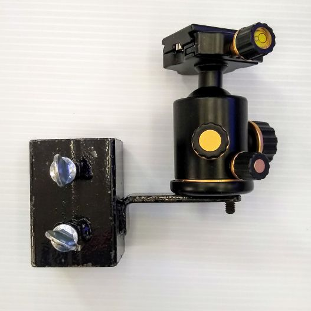
  
:Model number(s): 
  N/A
:Homologation number(s):
  N/A
:Relevant rule(s):
  N/A
:Description: 
  Used to attach photocell to finish post.
:Troubleshooting: 
  Is it broken? Don't whack it with the hammer!
  
Scored Finish Post
------------------

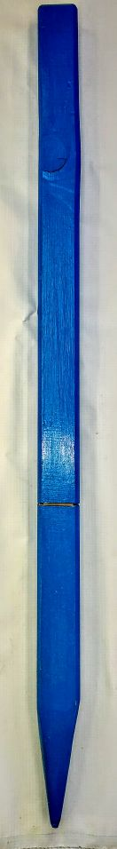
  
:Model number(s): 
  N/A
:Homologation number(s):
  N/A
:Relevant rule(s):
  N/A
:Description: 
  Wooden post to hold photocells. Scored at the bottom on all four sides to allow for easy breakage upon impact, per FIS rules.
:Troubleshooting: 
  Be easy. Don't smash it with your boot, or a drill, or a hammer.
  
Cheese Wedge Pad
----------------

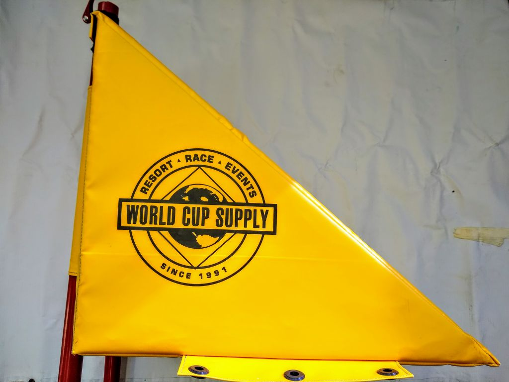
  
:Model number(s): 
  N/A
:Homologation number(s):
  N/A
:Relevant rule(s):
  N/A
:Description: 
  Plastic and foam pad, used to protect finish posts and photocells.
:Troubleshooting: 
  Make sure backing posts have clips attached to prevent losing them.
  
Finish Panel
------------

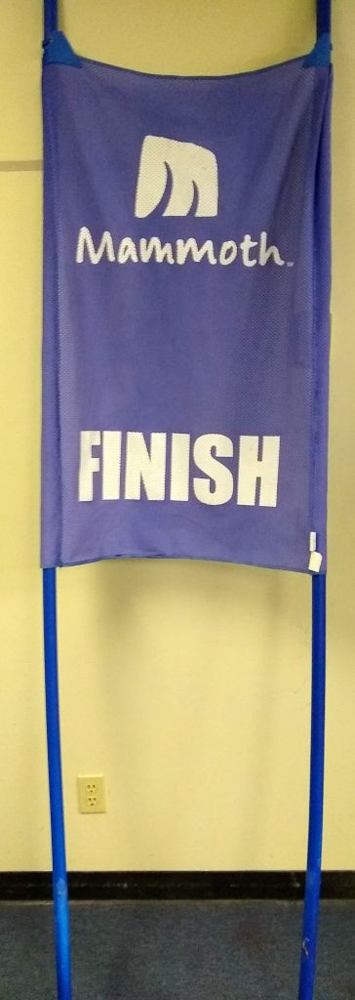
  
:Model number(s): 
  N/A
:Homologation number(s):
  N/A
:Relevant rule(s):
  N/A
:Description: 
  Red or blue branded Mammoth panel on static SPM poles. Used to mark finish line.
:Troubleshooting: 
  Replace with correct branding.
  
Homologated Timer
----------------

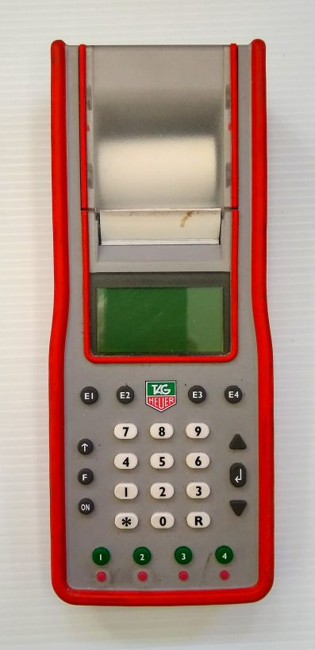
  
:Model number(s): 
  CP 540, CP 545
:Homologation number(s):
  TAG.070T.08 (CP 540), TAG.092.14 (CP 545)
:Relevant rule(s):
  :term:`611.2.1`
:Description: 
  TAG Homogated ToD timing device. 4 input channels. See CP 540 Section.
:Troubleshooting: 
  See CP 540 Section.
  
Hand Watch
------------

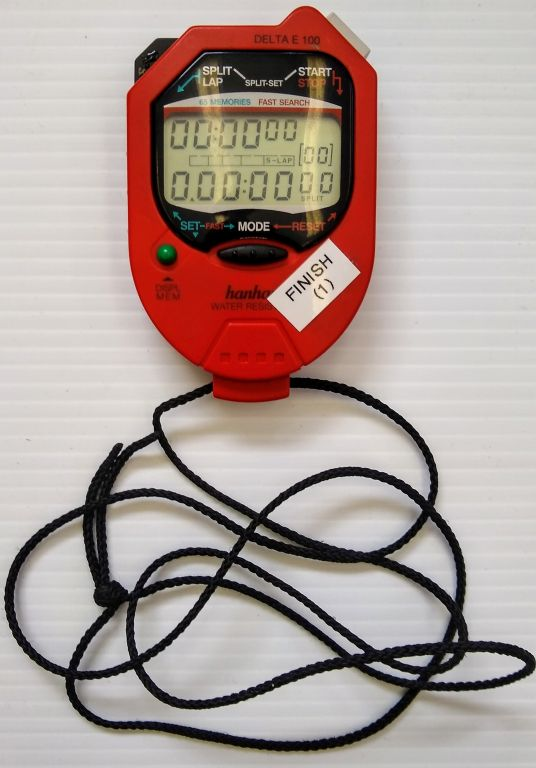
  
:Model number(s): 
  Hanhart Delta E 100
:Homologation number(s):
  N/A
:Relevant rule(s):
  :term:`611.2.2`
:Description: 
  Hand watch operating in time of day mode, capturing split times to the 1/100th of a second.
:Troubleshooting: 
  See document :doc:`in-depth/hanhart-delta-e-100`
  
Alge Self Timer
---------------

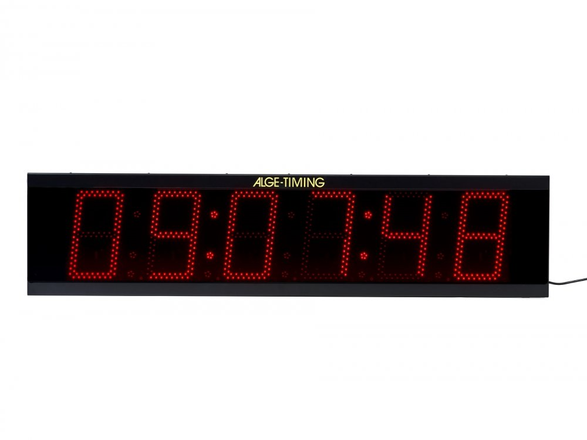
  
:Model number(s): 
  Alge Selftimer SF3
:Homologation number(s):
  N/A
:Relevant rule(s):
  N/A
:Description: 
  Display board with built in timing functionality. Used with :ref:`Free Course Start Controller` for the public free course.
:Troubleshooting: 
  See document :doc:`in-depth/alge-self-timer`
  
Wiring and Cables
~~~~~~~~~~~~~~~~~

Pigtail
-------

.. image:: /img/equipment/pigtail.jpg
  :width: 25%
  :align: left
  
:Model number(s): 
  N/A
:Homologation number(s):
  N/A
:Relevant rule(s):
  N/A
:Description: 
  Cable with banana plug on either end. Comes in a wide variety of lengths, the most basic cable for making timing connections.
:Troubleshooting: 
  Check for damage.

TAG-to-TAG Cable
----------------

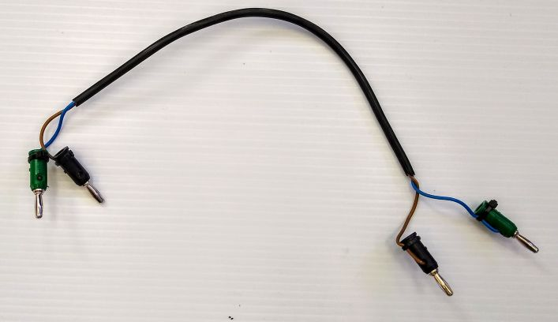
  
:Model number(s): 
  N/A
:Homologation number(s):
  N/A
:Relevant rule(s):
  N/A
:Description: 
  Short cable with single TAG style plugs on either end. Used mainly for connecting distributors to timers.
:Troubleshooting: 
  Check for damage.
  
Tag-to-Banana Cable
-------------------

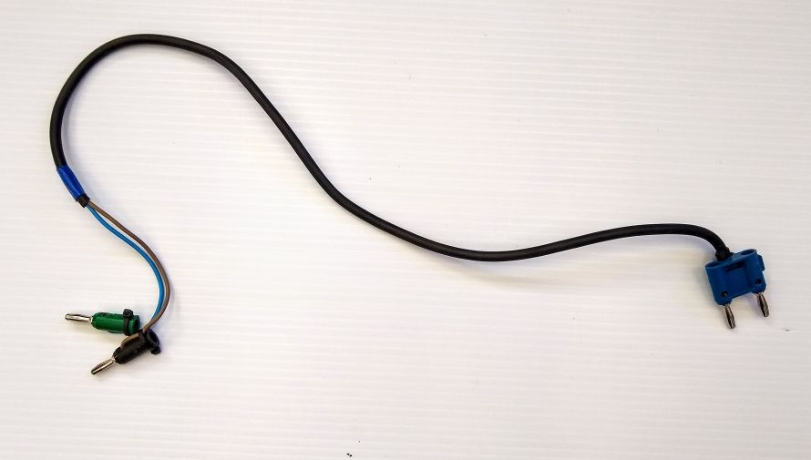
  
:Model number(s): 
  N/A
:Homologation number(s):
  N/A
:Relevant rule(s):
  N/A
:Description: 
  Short cable with single TAG style plugs on one end and a double banana plug on the other end. Used for connecting impulse distributors to shack timing boards, or for connecting photocells to wire spools.
:Troubleshooting: 
  Check for damage.
  
Long Start Wand Cable
---------------------

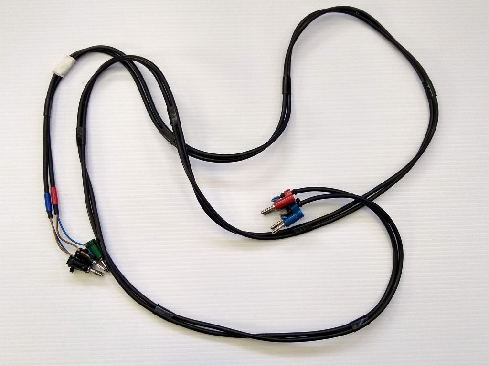
  
:Model number(s): 
  N/A
:Homologation number(s):
  N/A
:Relevant rule(s):
  N/A
:Description: 
  Two long adjoined banana-plug-to-TAG-plug adaptors. Used for connecting start block to wire spool.
:Troubleshooting: 
  Check wires, plugs, and connections for signs of damage.
  
Short Start Wand Cable
----------------------

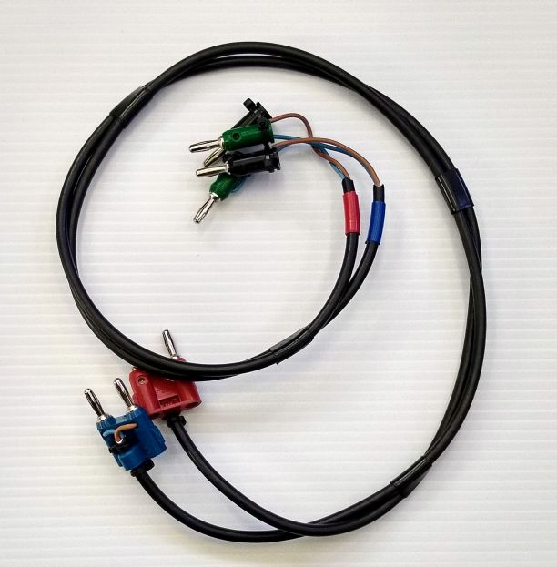
  
:Model number(s): 
  N/A
:Homologation number(s):
  N/A
:Relevant rule(s):
  N/A
:Description: 
  Two short adjoined banana-plug-to-TAG-plug adaptors. Used for connecting start block to wire spool.
:Troubleshooting: 
  Check wires, plugs, and connections for signs of damage. 
  
RS-232 Cable with USB Adaptor
-----------------------------

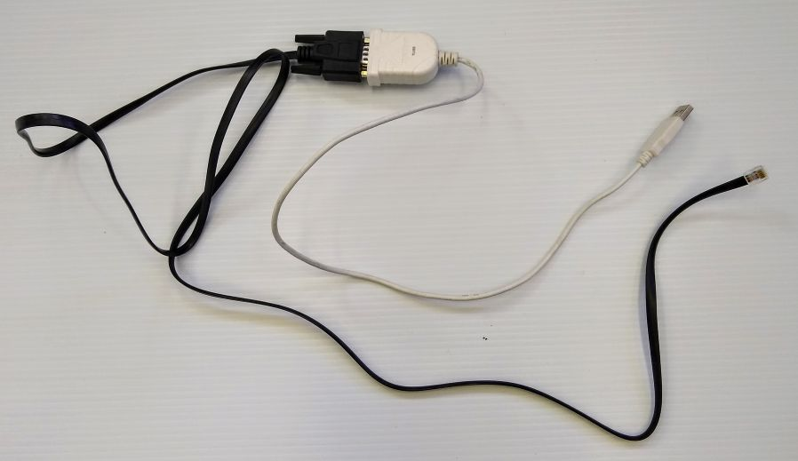
	
:Model number(s): 
  N/A
:Homologation number(s):
  N/A
:Relevant rule(s):
  N/A
:Description: 
  Serial cable with USB adaptor attached. Used to connect TAG timing devices to computer.
:Troubleshooting: 
  Make sure adaptor is securely connected. If trouble persists, try a different adaptor.
  
Three Pair Spool
----------------

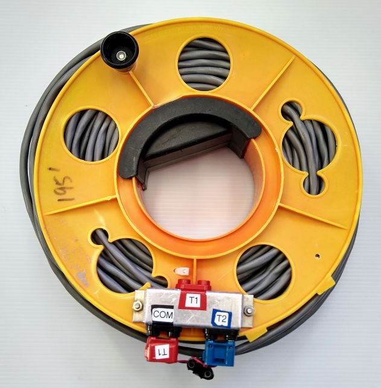
  
:Model number(s): 
  N/A
:Homologation number(s):
  N/A
:Relevant rule(s):
  N/A
:Description: 
  Wire spool with three pairs, normally labeled Time 1, Time 2, and COM. Used especially for connecting homologated start boxes and headsets to hill wire.
:Troubleshooting: 
  Check for obvious damage. If there is no obvious damage, use line break detector to determine location of damaged section.
  
Two Pair Spool
----------------

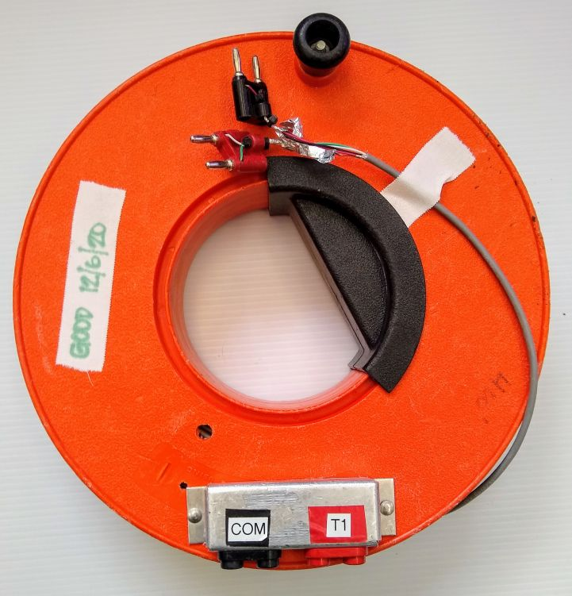
  
:Model number(s): 
  N/A
:Homologation number(s):
  N/A
:Relevant rule(s):
  N/A
:Description: 
  Wire spool with two pairs, normally labeled Time 1 and COM. Used especially for connecting start blocks and headsets for non-homolgated races.
:Troubleshooting: 
  Check for obvious damage. If there is no obvious damage, use line break detector to determine location of damaged section.
  
Hand Spool
----------------

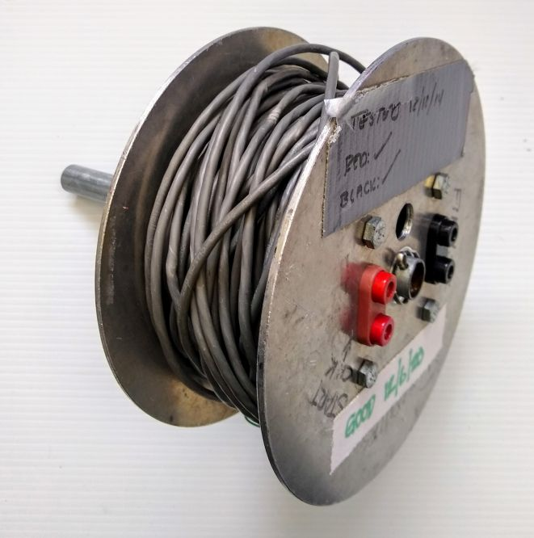
  
:Model number(s): 
  N/A
:Homologation number(s):
  N/A
:Relevant rule(s):
  N/A
:Description: 
  Small metal wire spool with two pairs, normally labeled Time and Com. Useful for making photocell connections at the finish, or for running scoreboard communications.
:Troubleshooting: 
  Check for obvious damage. If there is no obvious damage, use line break detector to determine location of damaged section.
  
  
