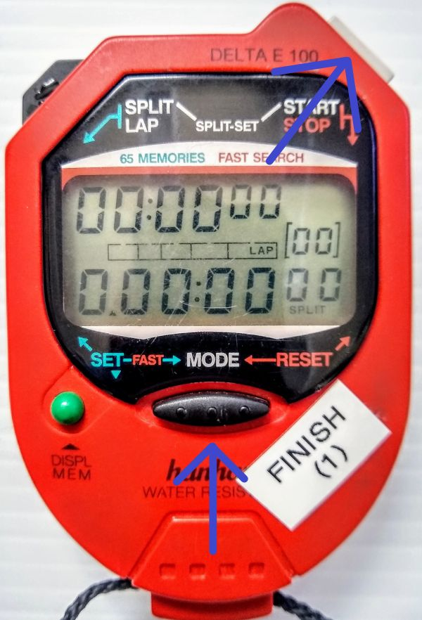
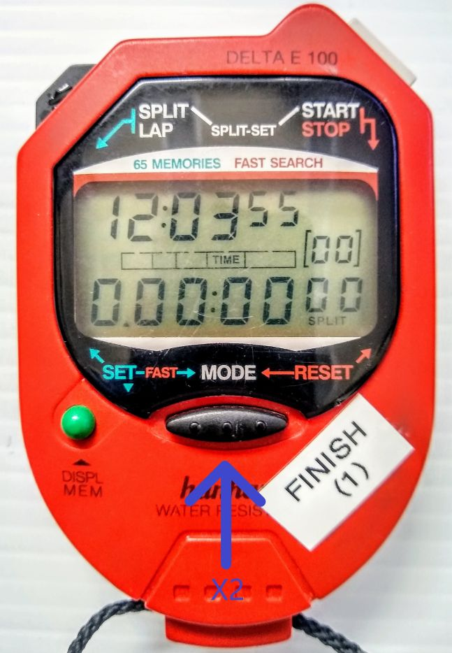
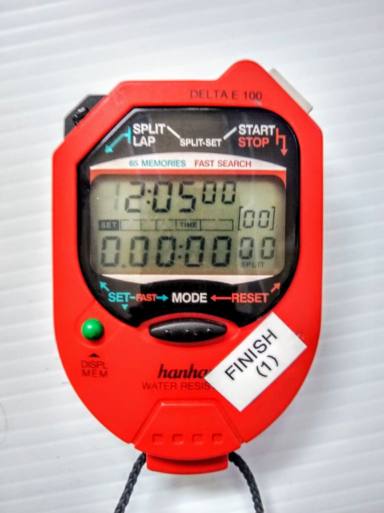
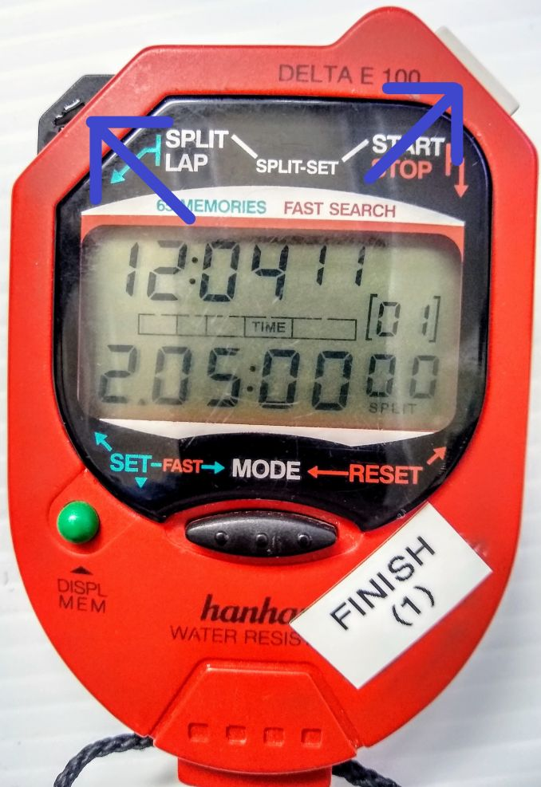
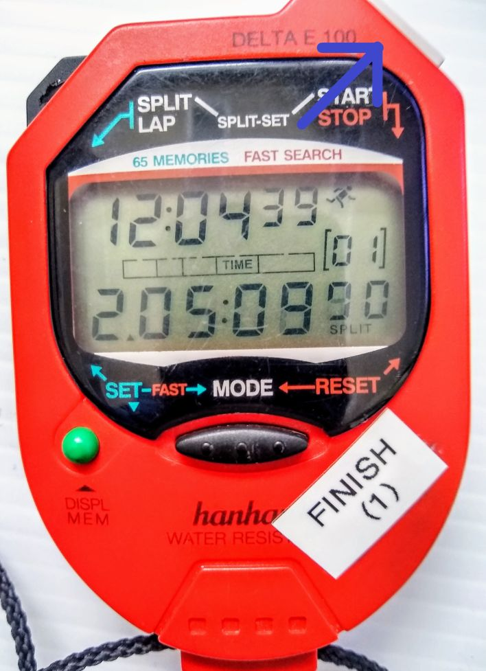

Hanhart Delta E 100
===================
*Relevant ICR Section:* :term:`611.2.2`

.. image:: ../../img/equipment/handtiming-watch.jpg
  :width: 50%
  :align: center
  
The Hanhart Delta E 100 is a Time of Day (ToD) stopwatch used to take handtimes. The top line is the system time of the watch, which should be set at least twice a year following daylight savings time. The system times of all the watches do not have to be exactly the same, but should be within about 30 seconds of each other and the actual time of day. The middle bar shows the mode the watch is in. The bottom line shows the split time. This is what is synced before each race, and is not necessarily the same as the system time on the top line.
  
Setting System Time
-------------------
The internal system time should be set at least twice a year following time changes for daylight savings, and any time it drifts more than 30 seconds from the actual time of day.

Step 1 - Reset the watch
~~~~~~~~~~~~~~~~~~~~~~~~

	
Press the MODE button (bottom middle) and START/STOP button (top right) simultaneously. The top and bottom time lines will display all zeros and the mode bar will show 'LAP'.

Step 2 - Set 'TIME' mode
~~~~~~~~~~~~~~~~~~~~~~~~

	
Press the MODE button (bottom middle) twice. The mode bar will show 'TIME' and the top line will show the system time. The bottom line will still show all zeros.

Step 3 - Set time
~~~~~~~~~~~~~~~~~

	
Press the green DISPL MEM button (bottom left). The first hour digit will begin flashing. Use the black SPLIT/LAP button (top left) to cycle through numbers and the DISPL MEM button to advance digits. Set a time at least a minute ahead of the actual time of day, according to an atomic clock, a computer synced to internet time, or other accurate timepiece.

Watch the actual time of day on your accurate timepiece, and when it matches the time of day on the hand watch press the MODE button (bottom middle). You should now have a running system time on the top line that reflects the accurate time of day.

Syncing Hand Watches
--------------------
All hand watches should be synced prior to the start of the first run, following rule :term:`611.2.2`. They should be synced to the same clock used to sync the System A and System B electronic timers. Perform the following steps on all watches being synced.

Step 1 - Reset the watch
~~~~~~~~~~~~~~~~~~~~~~~~

	
Press the MODE button (bottom middle) and START/STOP button (top right) simultaneously. The top and bottom time lines will display all zeros and the mode bar will show 'LAP'

Step 2 - Set 'TIME' mode
~~~~~~~~~~~~~~~~~~~~~~~~

	
Press the MODE button (bottom middle) twice. The mode bar will show 'TIME' and the top line will show the system time. This should be within 30 seconds of the actual time of day and all other hand watches being synced. The bottom line will still show all zeros.

Step 3 - Set the split time
~~~~~~~~~~~~~~~~~~~~~~~~~~~

	
Press the SPLIT/LAP button (top left) and START/STOP button (top right) simultaneously. The bottom (split time) line will show the next minute from the system time on the top line. For example, if the system time is 12:04:11, the split time will be set at 12:05:00.00. Note that the first digit of the hour is omitted, so the watch will display '2:05:00.00'.

All watches being synced should be set to the same split time.

Step 4 - Sync Watches
~~~~~~~~~~~~~~~~~~~~~

	
Watch the actual time of day on the same clock used to sync System A and System B, and at the appropriate time press the START/STOP button (top right) on all watches simultaneously. This will sync the watches to the actual Time of Day, to System A and System B, and to each other. This can be accomplished in several ways. You can hold two watches in each hand, or hold all the watches against the edge of a table.

There should now be a running split on the bottom of all watches that is exactly the same. The system times on the top lines may be different, but the split times should be the same. This can be verified by pressing the black SPLIT/LAP button (top left) on two or more watches simultaneously. The split time on the bottom should be the same or very close.