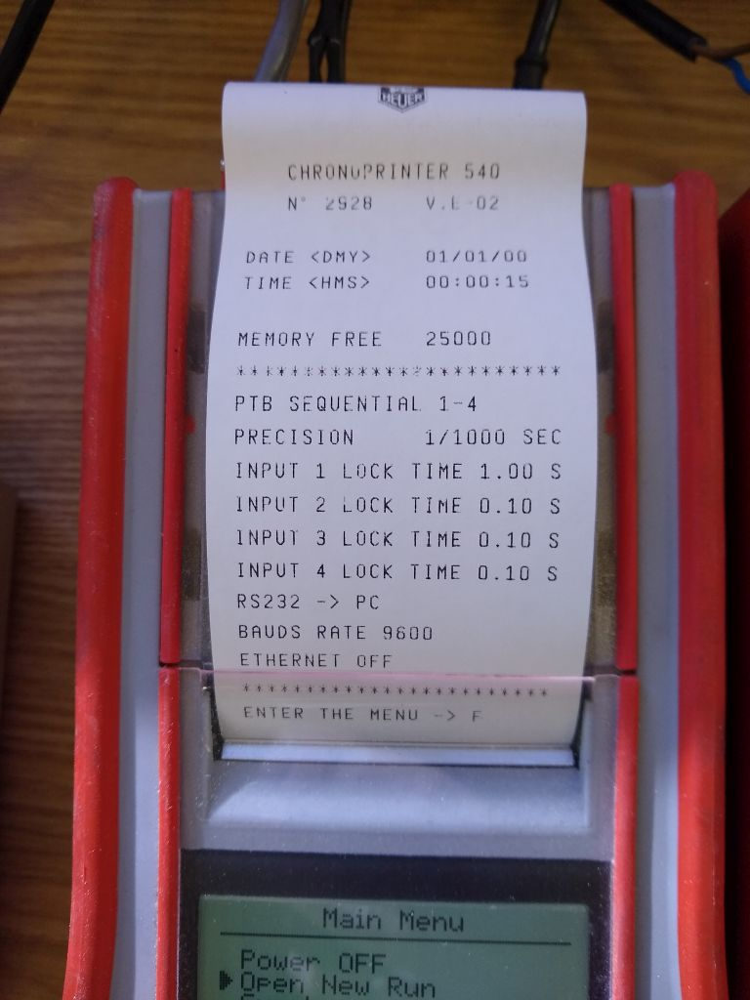
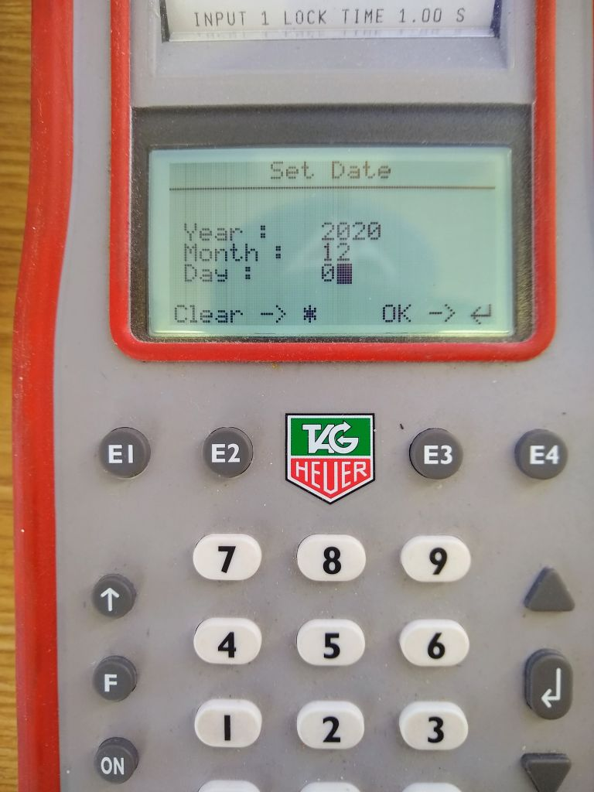
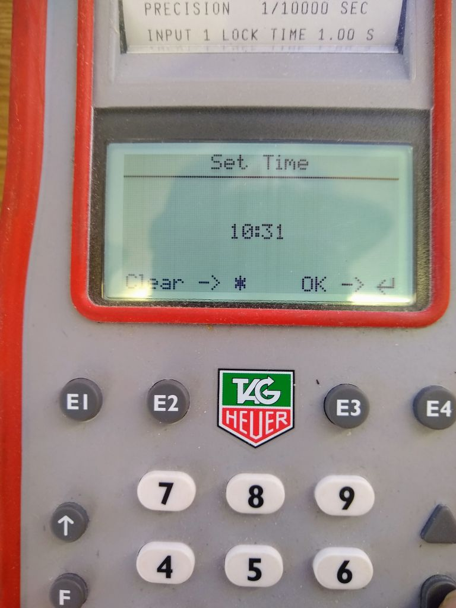
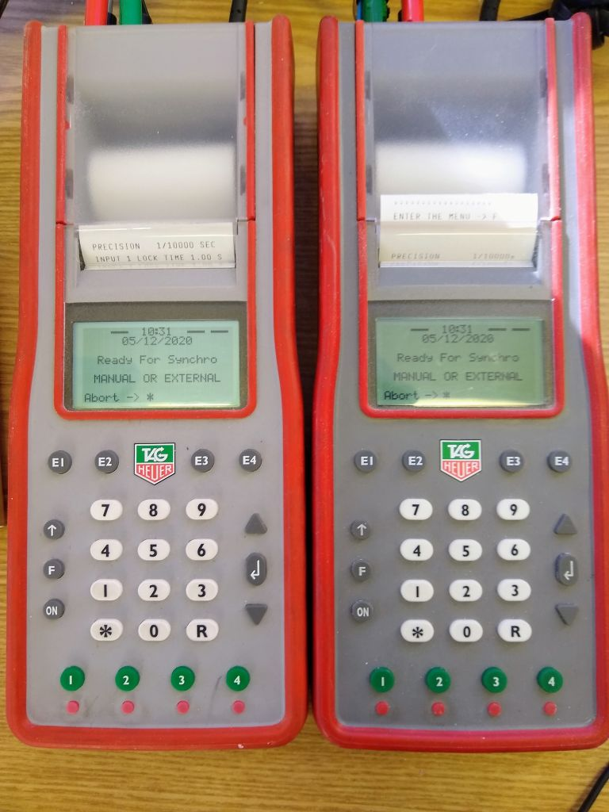
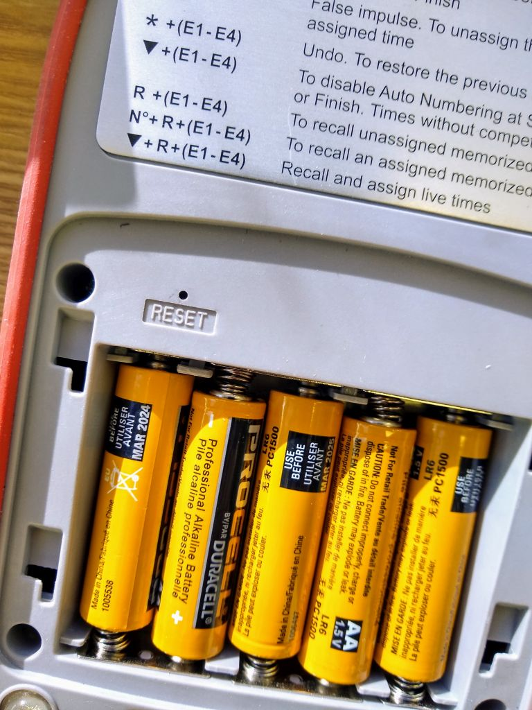

TAG-Heuer CP 540/545
====================
| *Relevant ICR section:* :term:`611.2.1`
| *Full manual:* `<https://reliableracing.com/downloads/cp540.pdf>`_

.. image:: ../../img/equipment/cp540.jpg
  :width: 50%
  :align: center

The TAG CP 540/545 is the main timer used for homologated races at Mammoth Mountain. It operates in Time of Day mode and prints impulses continuously to tape as per FIS rules. It can time to a maximum precision of 1/100,000th of a second, although only 1/10,000th is needed for scored races. This page will explain some common tasks and settings.

Basic setup
-----------
To turn on the CP 540, press and hold the on button for 5 seconds. If it doesn't turn on, see :ref:`CP 540 won't turn on`.

The 'F' button is used to access the menu, and the arrows and return key buttons on the right are used to navigate. The green buttons on the bottom represent timing inputs 1-4. The small red buttons below them are used to block or unblock the inputs.

Turning on the printer
~~~~~~~~~~~~~~~~~~~~~~
The printer should be on by defualt, although it can shut itself of if the timer is running on low battery power. The printer must be on at all times according to FIS rules (:term:`611.2.1`). To ensure that it is on, navigate to :menuselection:`F --> Printer --> On`.

Setting timing precision
~~~~~~~~~~~~~~~~~~~~~~~~
FIS rules require timing precision of at least 1/10,000th of a second (0.0001 s). To set this, navigate to :menuselection:`F --> Parameters --> Precision --> 1/10'000`.

Set lock time
~~~~~~~~~~~~~
The lock time is the interval following an impulse that the timer will not accept another impulse. This is useful to avoid multiple false impulses for the same racer. For example, if a racer breaks the finish beam with their pole first, then their boot 0.02 s later, the first impulse is their legal finish time and the second one is not needed. The second impulse will likely cause a false finish for the next racer. To avoid this, finish impulse lock times can be set at 0.10 s. Don't set this interval too high, because close finishes can happen. For adaptive races with visually impaired racers skiing with a guide this setting must be set as low as possible.. See :ref:`Adaptive and Paralympic Races`. Start impulse lock times can be set much higher, because there is no chance of two legal start happening within seconds of each other.

To set the lock times, navigate to :menuselection:`F --> Parameters --> Lock Time --> Input #` and enter the desired time. The minimum is 0.01 s. After setting, the lock time will be printed to the tape.

Here is an example of a timer with a :ref:`start gate <Start Block>` connected to input 1 with a lock time of 1.00 second, and :ref:`photocells <Photocell Pair>` for interval times and the finish connected to inputs 2-4 with lock times of 0.10 s.

Syncing timers
--------------
System A and System B timers must be synced to the time of day and to each other, within 1/1,000th of a second (0.001 s) per the `FIS Timing Booklet <https://assets.fis-ski.com/image/upload/v1602156953/fis-prod/assets/AlpineTimingbooklet-V2_59-E.pdf>`_. According to rule :term:`611.2.1`, synchronization must occur as close as possible to the start of the first run of the day. It is no longer required to sync timers between runs, genders, or races occuring on the same day. A good rule of thumb for when to sync is around 15 minutes before the scheduled start of the first run.

First, navigate to :menuselection:`F --> Synchro --> Manual or External` on both timers and set the date.

.	:align: left

Next, enter the time you plan to sync. Make sure to give yourself enough time to be ready and accurate.

.	:align: left
	
Both timers should now display 'Ready For Synchro'. **Make sure to unblock input 1 and turn on your distributors before you sync!**

.	:align: left
	
Traditionally the timers have been synced using an impulse from the start wand. However, this is no longer really correct. The `FIS Timing Booklet <https://assets.fis-ski.com/image/upload/v1602156953/fis-prod/assets/AlpineTimingbooklet-V2_59-E.pdf>`_ states:
	The synchronisation impulse for all timers must come from one single source (one contact) for all timing devices.
A homologated start wand contains two contacts by definition, therefore should not be used to sync the timers. The best and easiest way to legally sync the timers is to use a :ref:`Push Button Switch`. This contains one single contact and is easy to set up in the timing shack. To do so, piggy back each banana plug from the switch into your start connections, in this example TIMING 1 and TIMING 2.

picture here

Now, looking at your master timepiece (normally the PC system time), press the push button switch at exactly the time shown on the top of the CP 540. The timing tape should now show:
	| SYNCHRO AT	hh:mm:ss
	| DATE <DMY>	dd/mm/yy
	
For example:

picture here

The timers are now synced. The final step is to confirm the synchronization, per the `FIS Timing Booklet <https://assets.fis-ski.com/image/upload/v1602156953/fis-prod/assets/AlpineTimingbooklet-V2_59-E.pdf>`_:
	After synchronisation is done, a new impulse must be sent by the same source to check synchronisation accuracy on Systems A and B. The maximum allowed difference between system A and B is 0.001 seconds.
	
In practice this is done by pressing the push button switch again around one minute (but not less) after sync. Since we are using a single contact switch, the synchronization will likely be exact down to the 1/10,000th of a second, but it is legal as long as it is within 1/1,000th. Make a note of both the sync time and the sync+1 confirmation times, as these will be used in the :ref:`TDTR`.

Troubleshooting
---------------

CP 540 won't turn on
~~~~~~~~~~~~~~~~~~~~
Make sure you are holding the 'ON' button down for at least 5 seconds.

If the CP 540 still won't turn on, the most likely cause is dead batteries. The first thing to do is check and replace the 5 AA batteries in the back of the timer.

If the CP 540 has been run until the batteries die completely, it may not turn on even after replacing the batteries or connecting to hard power. To fix this, remove the battery cover and insert a paperclip or something similar into the hole labeled 'RESET' and press rapidly at least 40 times (really). The CP 540 should then start up normally.

If it still doesn't turn on, inspect the inputs on the back for damage. Lightning can cause a massive power surge on the timing lines. This will require the timer to be sent in for service.

Printer keeps turning off
~~~~~~~~~~~~~~~~~~~~~~~~~
This happens when running on low battery power. Make sure the batteries are good, and make sure the connection to hard power is secure. A loose or unreliable power cable can cause the timer to draw from battery power and automatically turn off the printer.