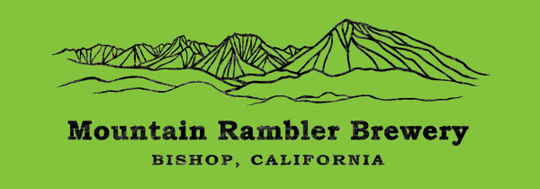

.. MRB Docs master file, adpated from
   Mammoth Timers Guide documentation master file, created by
   sphinx-quickstart on Wed Dec  2 14:56:18 2020.
   You can adapt this file completely to your liking, but it should at least
   contain the root `toctree` directive.

.. include:: ../../README.rst

.. toctree::
   :maxdepth: 1
   :includehidden:
   :caption: How to...
   :glob:
   
   how-to/*

.. toctree::
   :maxdepth: 1
   :includehidden:
   :caption: Beer
   :glob:
   
   menu/beer/*

.. toctree::
   :maxdepth: 2
   :includehidden:
   :caption: Menu items
   
   menu/food/burgers/burgers.rst
   menu/food/sandwiches/sandwiches.rst

.. toctree::
   :maxdepth: 2
   :includehidden:
   :caption: Sides, sauces, and ingredients
   
   menu/food/sides/sides.rst
 
.. toctree::
   :maxdepth: 2
   :includehidden:
   :caption: Reference
   
   links

Indices and tables
==================

* :ref:`genindex`
* :ref:`modindex`
* :ref:`search`
