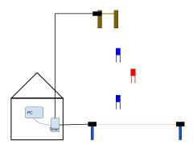
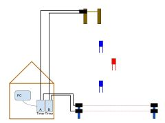

Electronic Timing
=================
*Relevant ICR section:* :term:`611.2.1`

Ski races are timed using computerized electronic timing systems. The job of timing technicians at Mammoth Mountain is to install, maintain and operate these systems.

In its most basic form, an electronic timing system consists of a :ref:`start wand <Start Block>` and a finish :ref:`photocell <Photocell Pair>` connected to an :ref:`electronic timer <Homologated Timer>`. This electronic timer is then connected to PC running software that calculates net times and produces results.

	
Timing devices, such as start wands and finish photocells, are connected to the electronic timer with copper wire pairs. The device itself operates as a simple normally open switch |switch|. When the start wand is opened or the finish beam broken, the switch closes momentarily and creates a short across the wire pair. This brief short is referred to as an **impulse**. Impulses form the basic signals of our timing system.

.. glossary::
	
	Impulse
		A "short-circuit" signal, generated by a timing event such as a start or a finish.

The electronic timer has multiple inputs for multiple timing devices, and as such each timing device needs to be on its own wire pair. When the timer receives an impulse it records the input number and the time of day, precise to the 1/10,000th of a second. The timer then prints this information to tape and sends it to the PC. In this way it is possible to calculate net times.

**timing tape example here**

For all scored FIS and US Ski & Snowboard races, which are the focus of this book, two electronic systems (one primary and one backup) must be used according to rule :term:`611.2.1`. This ensures redundancy in the case of equipment or wiring failure during the race, or of human error.

	
	Basic homologated setup. See also the :ref:`Setup` section.

In addition to the two electronic systems, a manual backup system must be used according to rule :term:`611.2.2`. This system consists of staff, normally volunteers, operating Time-of-Day stopwatches at the start and finish known as :ref:`Handtimers`. In the case of a failure of System A, a corrected impulse from system B can be used. In the case of a failure of both electronic timing systems the impulse is replaced from the hand times. This process is described in rule :term:`611.3.2.1` and in the :ref:`EET` section of this manual.

